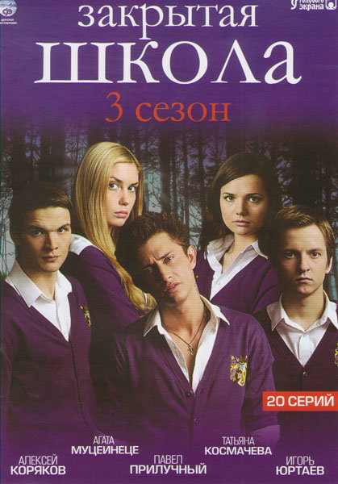

# Документация курса по веб-программированию 2021-2022

## Оглавление
- На странице `semester 1` выложен отчет по 3-й и 4-й лабораторных работах осенней части курса, в рамках которых необходимо было начать создавать веб-приложение
- На странице `semester 2` выложены отчеты по всем 4 лабораторным работам весенней части курса, целью которых было расширить функционал созданного веб-приложения
- На странице `Курсовой проект` лежит описание курсовой работы "Создание web-приложения для информационной системы колледжа"
