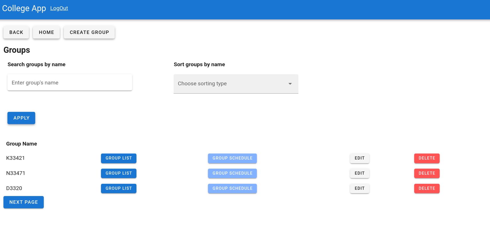

# Конечный функционал веб-приложения

## Регистрация и авторизация
### Интерфейс регистрации

Регистрация подразумевает выбор роли из следующего перечня:

- manager
- deputy

### Интерфейс авторизации

Для простоты демонстрации приложения функционал ролей __manager__ и __deputy__ был объединен. В ином случае он легко настраивается в `views.py`

## Домашняя страница

Данная представляет собой навигационную панель по приложению.  
Здесь сразу же доступны все самые основные клиентские интерфейсы:

- Интерфейсы для просмотра и изменения информации о студентах
- Интерфейсы для просмотра и изменения информации об учителях
- Интерфейсы для просмотра и изменения информации о предметах
- Интерфейсы для просмотра и изменения информации об оценках
- Интерфейсы для просмотра и изменения информации о группах
- Интерфейсы для просмотра и изменения информации о специальностях
- Интерфейсы для просмотра и изменения информации о парах

## Интерфейсы для просмотра и изменения информации о студентах
### Интерфейс списка всех студентов

В данном интерфейсе реализованы:

- фильтрация студентов по фамилии
- фильтрация студентов по имени
- фильтрация студентов по группе
- сортировка записей по различным характеристикам
- пагинация
- триггеры для перехода между страницами
- триггеры для добавления, удаления записей

### Интерфейс создания нового студента

В данном интерфейсы реализованы:

- форма для создания нового студента
- триггеры для перехода между страницами

### Интерфейс изменения студента

В данном интерфейсы реализованы:

- форма для изменения информации о существующем студенте
- триггеры для перехода между страницами

## Интерфейсы для просмотра и изменения информации об учителях
### Интерфейс списка всех учителей

В данном интерфейсе реализованы:

- фильтрация учителей по фамилии
- фильтрация учителей по имени
- фильтрация учителей по предметам
- фильтрация учителей по номеру кабинета
- фильтры на диапазон номер кабинета
- пагинация
- триггеры для перехода между страницами
- триггеры для добавления, удаления записей

### Интерфейс создания нового учителя

В данном интерфейсы реализованы:

- форма для создания нового учителя
- триггеры для перехода между страницами

### Интерфейс изменения учителя

В данном интерфейсы реализованы:

- форма для изменения информации о существующем учителе
- триггеры для перехода между страницами

## Интерфейсы для просмотра и изменения информации о предметах
### Интерфейс списка всех предметов

В данном интерфейсы реализованы:

- поиск предметов по названию
- сортировка предметов по названию
- пагинация
- триггеры для перехода между страницами
- триггеры для добавления, удаления записей

### Интерфейс создания нового предмета

В данном интерфейсы реализованы:

- форма для создания нового предмета
- триггеры для перехода между страницами

### Интерфейс для изменения предмета

В данном интерфейсы реализованы:

- форма для изменения информации о существующем предмете
- триггеры для перехода между страницами

## Интерфейсы для просмотра и изменения информации об оценках
### Интерфейс списка всех оценок

В данном интерфейсе реализованы:

- фильтрация оценок по имени студента
- фильтрация оценок по фамилии студента
- фильтрация по названию предмета
- фильтрация по группе
- фильтрация по значению оценки
- фильтры на диапазон оценки
- сортировка записей различным характеристикам 
- пагинация
- триггеры для перехода между страницами
- триггеры для добавления, удаления записей

### Интерфейс для создания новой оценки

В данном интерфейсе реализованы:

- форма для создания новой оценки
- триггеры для перехода между страницами

### Интерфейс для изменения оценки

В данном интерфейсы реализованы:

- форма для изменения информации о существующей оценке
- триггеры для перехода между страницами

## Интерфейсы для просмотра и изменения информации о группах
### Интерфейс списка всех групп

В данном интерфейсы реализованы:

- поиск групп по названию
- сортировка групп по названию
- пагинация
- триггеры для перехода между страницами
- триггеры для добавления, удаления записей

### Интерфейс создания новой группы

В данном интерфейсы реализованы:

- форма для создания новой группы
- триггеры для перехода между страницами

### Интерфейс для изменения группы

В данном интерфейсы реализованы:

- форма для изменения информации о существующей группе
- триггеры для перехода между страницами

### Интерфейс просмотра списка группы

В данном интерфейсе реализованы:

- триггеры для перехода между страницами

### Интерфейс просмотра расписания группы

В данном интерфейсе реализованы:

- триггеры для перехода между страницами

## Интерфейсы для просмотра и изменения информации о специальностях
### Интерфейс списка всех специальностей

В данном интерфейсе реализованы:

- фильтрация специальностей по названию
- фильтрация специальностей по группе
- фильтр "связана ли специальность с информационными технологиями"
- Сортировка записей по различным характеристикам
- пагинация
- триггеры для перехода между страницами
- триггеры для добавления, удаления записей

### Интерфейс для создания новой специальности

В данном интерфейсе реализованы:

- форма для создания новой специальности
- триггеры для перехода между страницами

### Интерфейс для изменения специальности

В данном интерфейсе реализованы:

- форма для изменения информации о существующей специальности 
- триггеры для перехода между страницами

## Интерфейсы для просмотра и изменения информации о парах

### Интерфейс списка всех пар

В данном интерфейсе реализованы:

- фильтрация пар по предмету
- фильтрация пар по учителю
- фильтрация пар по дню недели
- фильтрация пар по номеру урока
- фильтрация пар по аудитории
- фильтры на диапазон аудитории
- фильтры на диапазон номера урока
- сортировка записей по различным характеристикам
- пагинация
- триггеры для перехода между страницами
- триггеры для добавления, удаления записей

### Интерфейс создания новой пары

В данном интерфейсе реализованы:

- форма создания новой пары
- триггеры для перехода между страницами

### Интерфейс изменения пары

В данном интерфейсе реализованы:

- форма для изменения информации о существующей паре
- триггеры для перехода между страницами
