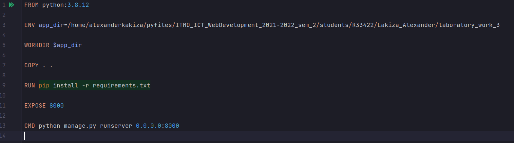
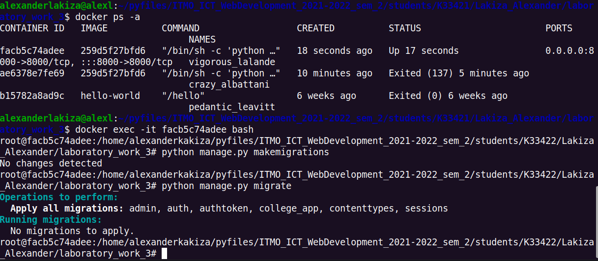

# Лабораторная работа №1. Контейнеризация и оркестрация.
## 1_1 Задание
- Написать Dockerfile для запуска бэкенд части проекта из курса "Web-программирование".
- Выполнить следующие действия:
  - Изменить модель БД Django
  - Зайти в контейнер и выполнить миграции
---
## Выполнение задания
- Написать Dockerfile для запуска бэкенд части проекта из курса "Web-программирование".  

- Зайти в контейнер и выполнить миграции  

