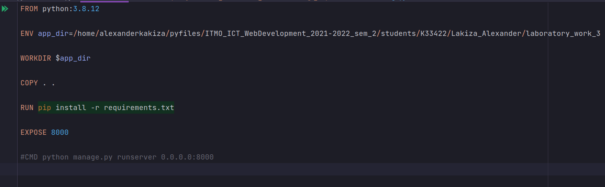
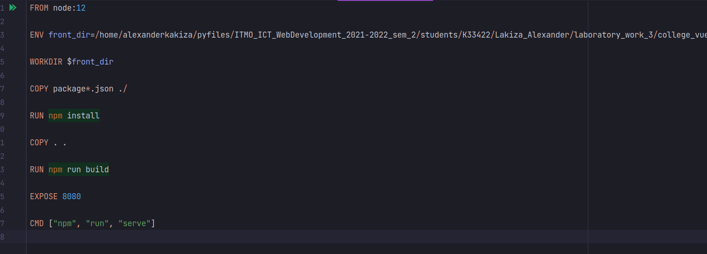
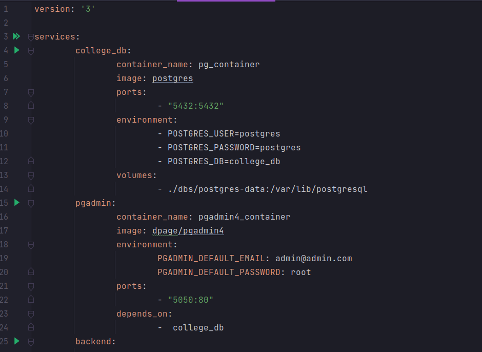
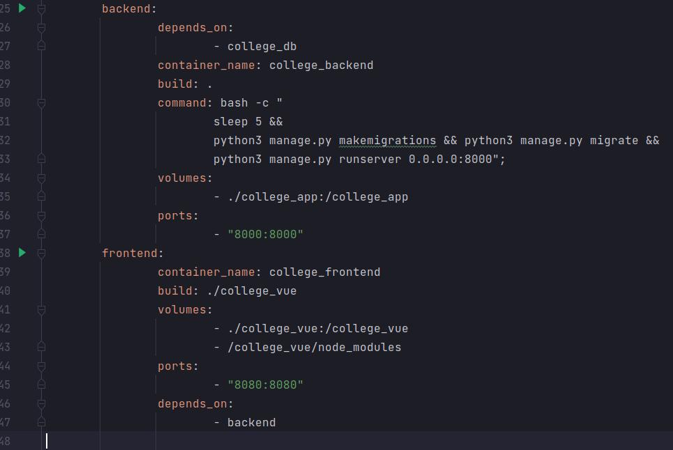
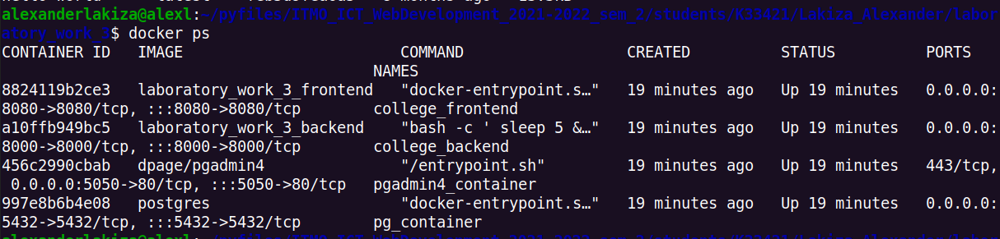
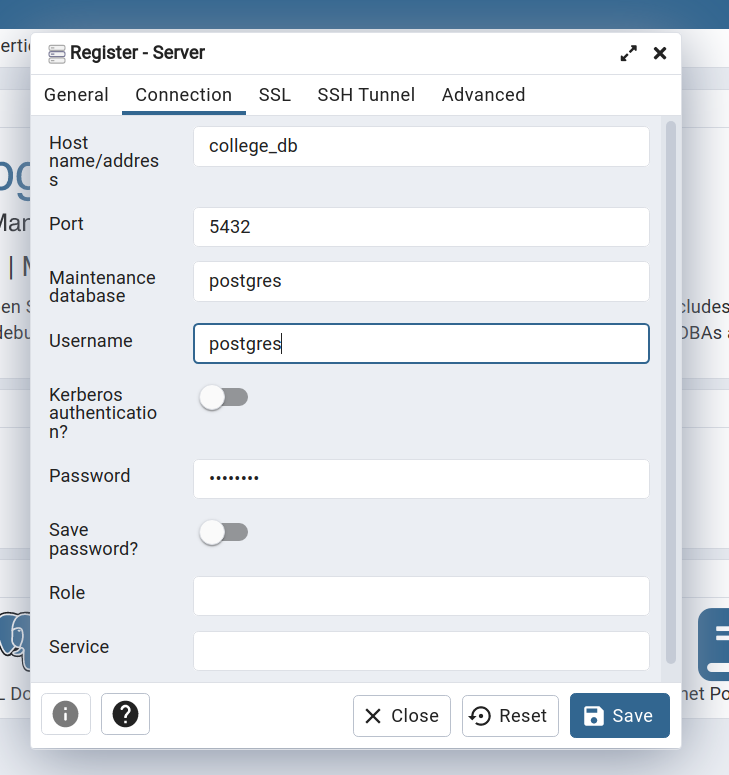
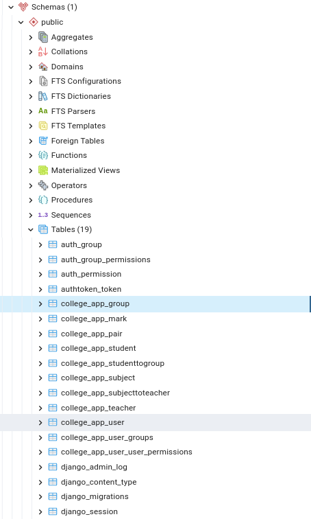

# Лабораторная работа №1. Контейнеризация и оркестрация.
## 1_2 Задание
- Реализовать работу в оркестре всех сервисов из 3 и 4 работы из курса "Web-программирование".
- Выполнить команды необходимые для того, чтобы добавить нового пользователя в БД Postgres. С попощью пользователя должна быть возможность подключиться к БД из приложения для работы с БД (Valentina DB).

---
## Выполнение задания
- Dockerfile для бэкэнда 

- Dockerfile для фронтенда  

- Docker-compose.yml

- `docker ps` - Статус контейнеров

Тут видно, что у 4-х сервисов (vue, django, pgadmin и postgresql) открыты порты
- Вход в pgadmin с помощью credentials user'а из docker-compose сервиса college_db  

- Пруф, что в пгадмине видна БД, прикрученная к Django

