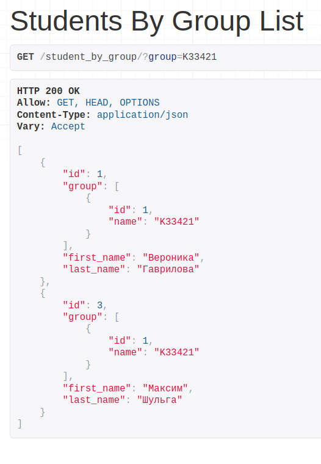
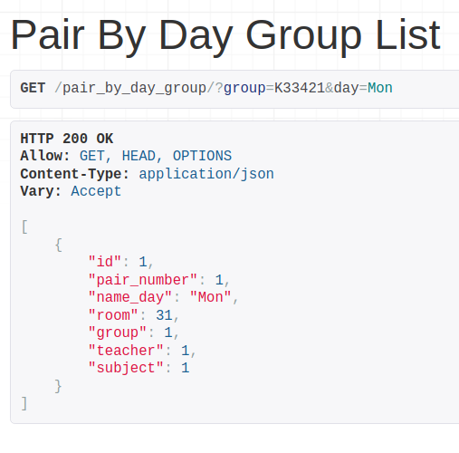
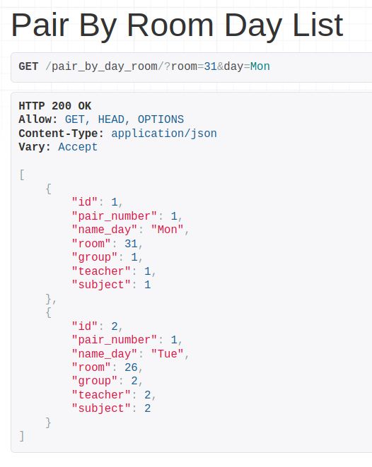
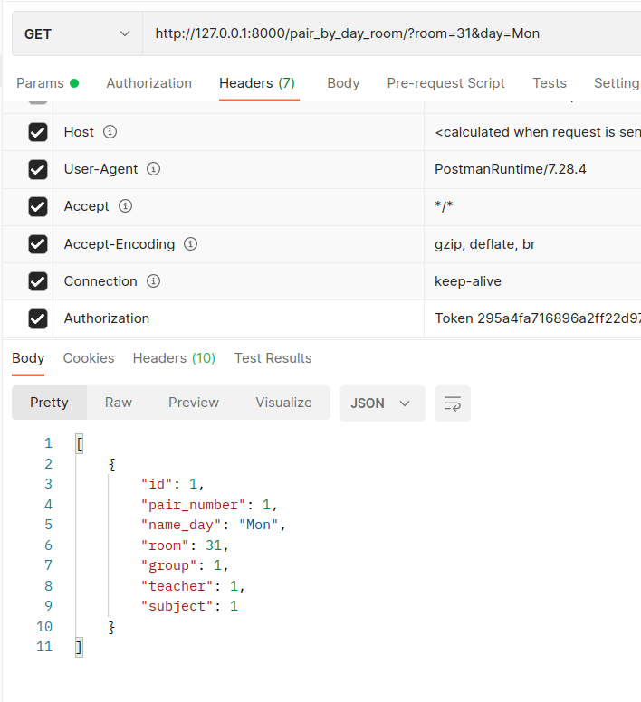

# Лабораторная работа №2. Возможности DRF.
## 2_1_1 Задание
Реализовать вручную следующие фильтры (в ручную значит, что Вам необходимо передать в url параметры, далее переопределить метод list или get_queryset, c целью взять параметры из url-адреса, выполнить с ними запрос и вернуть responce пользователю):

- принимает параметр из url-адреса и выводит отфильтрованные данные. (GET, ListAPIView)
- принимает 2 параметра из url-адреса и выводит отфильтрованные данные. (GET, ListAPIView)
- принимает 2 параметра из url-адреса и выводит отфильтрованные данные, если пользователь авторизован и неотфильтрованные, если не авторизован. (GET, ListAPIView)
  
Список фильтров и код их исполнения необходимо описать в mkdocs на странице с названием "2.1.1 Ручные фильтры"

---
## Выполнение задания
### Фильтр студентов по имени группы  

```python
class StudentsByGroupListView(ListAPIView):
    serializer_class = StudentSerializer

    def get_queryset(self):
        students_queryset = Student.objects.all()
        group_name = self.request.query_params.get('group')
        group_id = Group.objects.all().get(name=group_name).id

        if group_id:
            students_queryset = students_queryset.filter(group=group_id)

        return students_queryset
```
### Фильтр пар по дню и группе 

```python
class PairByDayGroupListView(ListAPIView):
    serializer_class = PairSerializer

    def get_queryset(self):
        day_name = self.request.query_params.get('day')
        group_name = self.request.query_params.get('group')
        group_id = Group.objects.all().get(name=group_name).id

        pair_queryset = Pair.objects.all()
        if group_id and day_name:
            pair_queryset = pair_queryset.filter(name_day=day_name, group=group_id)

        return pair_queryset
```
### Фильтр пар по аудитории и дню
Без аутентификации:


С аутентификацией:

```python
class PairByRoomDayListView(ListAPIView):
    serializer_class = PairSerializer

    def get_queryset(self):
        pair_queryset = Pair.objects.all()
        user = self.request.user

        if user.is_authenticated:
            room_num = self.request.query_params.get('room')
            day_name = self.request.query_params.get('day')

            if room_num and day_name:
                pair_queryset = pair_queryset.filter(room=room_num, name_day=day_name)

        return pair_queryset
```
