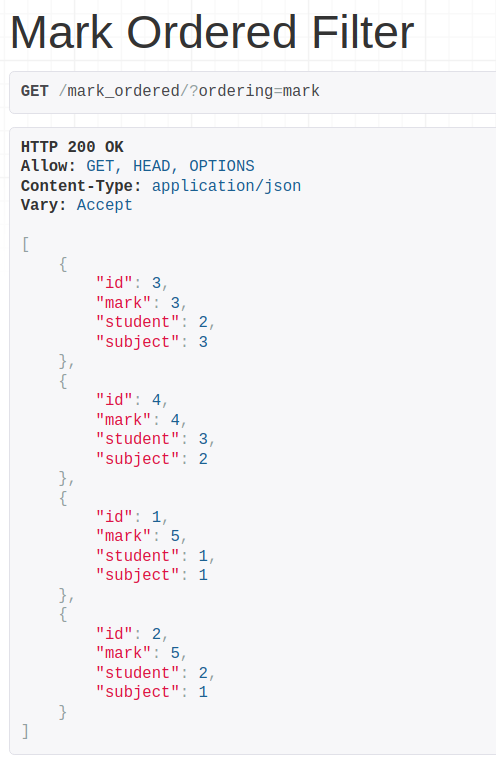
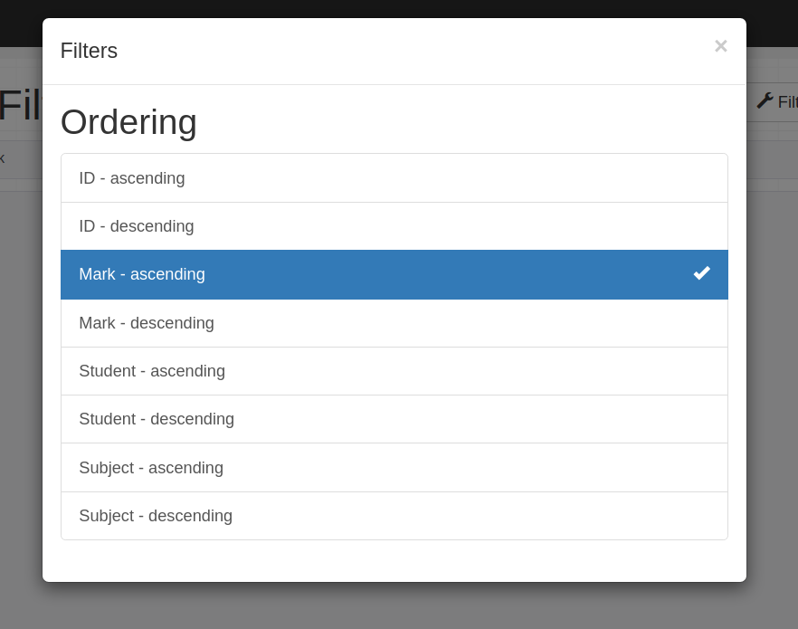
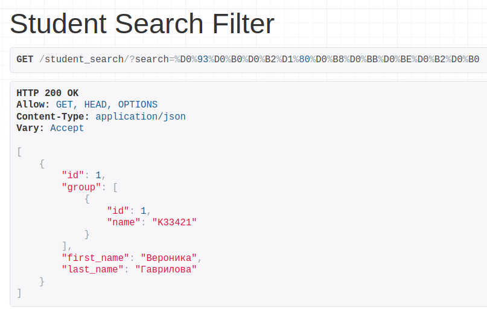
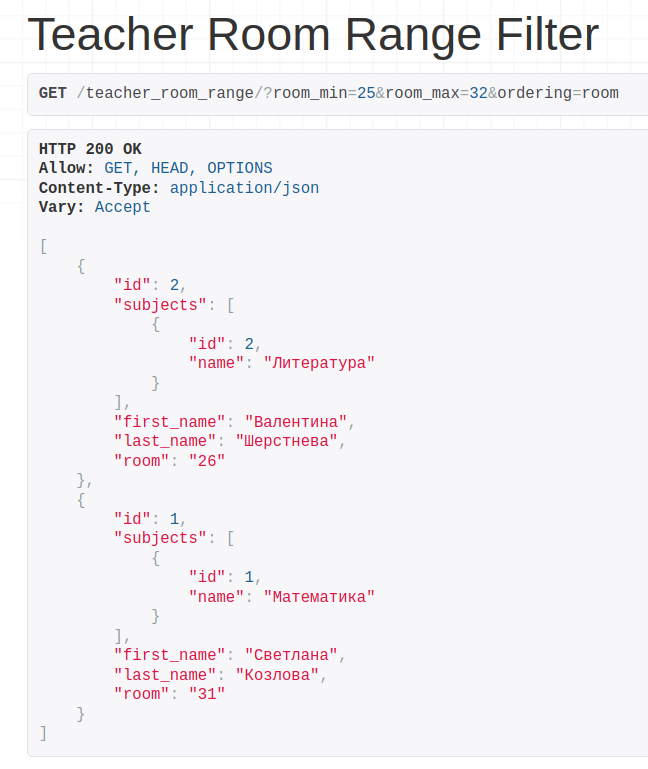

# Лабораторная работа №2. Возможности DRF.
## 2_1_2 Задание
Реализовать в ручную следующие фильтры (Необходимо использовать библиотеку django-filters:

- сортировка по дате, поиск, поиск по полям из связной таблицы
- сортировка в диапазоне цен, дат или каких-либо других числовых значений

Список фильтров и код их исполнения необходимо описать в mkdocs на странице с названием "2.1.2 Автоматические фильтры"
---
## Выполнение задания
### Фильтр всех оценок по величине оценки  


```python
class MarkOrderedFilterView(ListAPIView):
    queryset = Mark.objects.all()
    serializer_class = MarkSerializer
    filter_backends = (filters.OrderingFilter,)
    filterset_fields = ('mark', )
```

### Фильтр поиска студентов по фамилии

```python
class StudentSearchFilterView(ListAPIView):
    queryset = Student.objects.all()
    serializer_class = StudentSerializer
    filter_backends = (filters.SearchFilter,)
    search_fields = ('last_name', )
```


### Фильтрация по номеру аудитории в заданном промежутке

```python
class TeacherRoomRangeFilterView(ListAPIView):
    queryset = Teacher.objects.all()
    serializer_class = TeacherSerializer
    filterset_class = TeacherRoomRangeFilter
```

