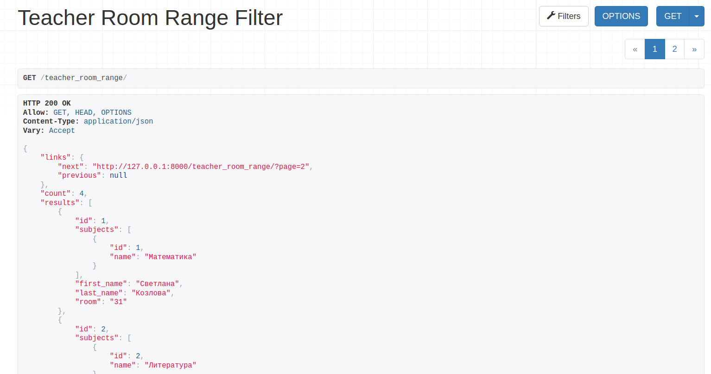
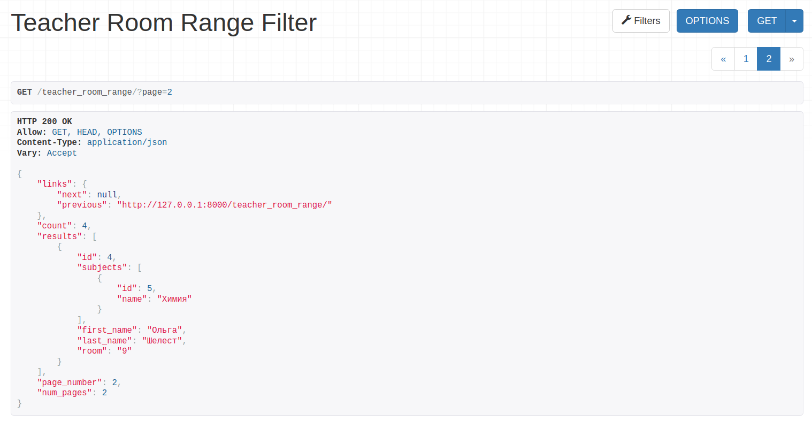

# Лабораторная работа №2. Возможности DRF.
## 2_2_1 Задание
Настроить пагинацию для любых списков в Вашем проекте.


Код и пример вывода описать в mkdocs на странице с названием "2.2.2 Кастомная пагинация"

---
## Выполнение задания
Добавили в settings.py параметры для автоматической пагинации
```python
    'DEFAULT_PAGINATION_CLASS':
        'rest_framework.pagination.PageNumberPagination',
    'PAGE_SIZE': 3
```


## 2_2_2 Задание
Написать и применить метод пагинации, который, кроме обычного вывода вернет количество страниц пагинации и номер текущей страницы

## Выполнение задания



`pagination.py`:
```python
class CustomPagination(pagination.PageNumberPagination):
    def get_paginated_response(self, data):
        return Response({
            'links': {
                'next': self.get_next_link(),
                'previous': self.get_previous_link()
            },
            'count': self.page.paginator.count,
            'results': data,
            'page_number': self.page.number,
            'num_pages': self.page.paginator.num_pages,
        })
```

`views.py`:
```python
class TeacherRoomRangeFilterView(ListAPIView):
    queryset = Teacher.objects.all()
    serializer_class = TeacherSerializer
    filterset_class = TeacherRoomRangeFilter

    # CUSTOM PAGINATION
    pagination_class = CustomPagination
```
