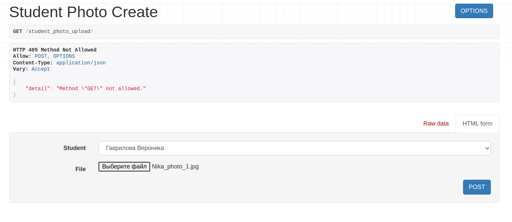
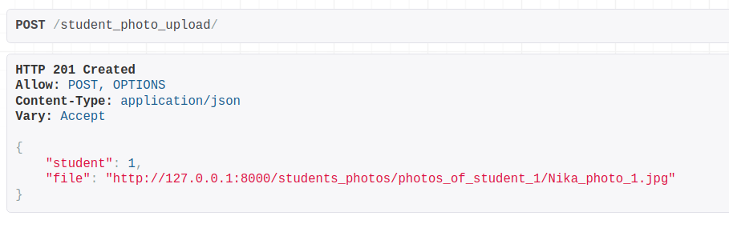
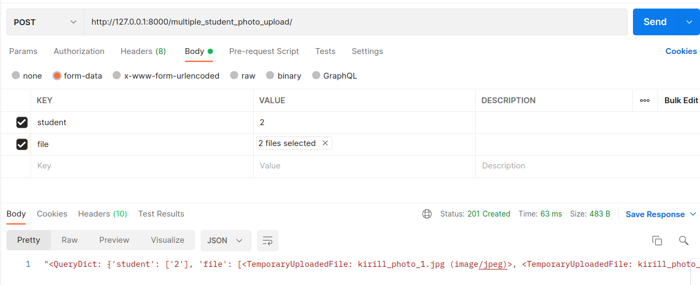
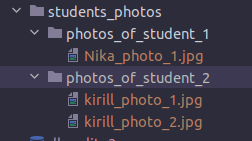

# Лабораторная работа №2. Возможности DRF.
## 2_3 Задание
Реализовать следующие ендпоинты:

- Ендпоинт для загрузки файлов, с указанием внешнего ключа на связный объект и сохранением имени и размера файла в базе данных.
- Ендпоинт для сохранения нескольких файлов и валидации на максимальный размер файла и доступные для загрузки расширения файлов.
Код и пример вывода описать в mkdocs на странице с названием " 2.3.1 Загрузка и валидация файлов"

---
## Выполнение задания
`validators.py`
```python
def validate_file_size(file):
    MAX_MB = 5
    limit = MAX_MB * 1024 * 1024

    if file.size > limit:
        raise ValidationError(f'The file size is more than {MAX_MB} MB.')


def validate_file_type(file):
    photo_extensions = ['image/png', 'image/jpeg', 'image/jpg']

    content_type = magic.from_buffer(file.read(), mime=True)
    if content_type not in photo_extensions:
        raise ValidationError(f'Files of type {content_type} are not supported.')
```
`models.py`
```python
def get_upload_path(instance, filename):
    return f'students_photos/photos_of_student_{instance.student.id}/{filename}'


class StudentPhoto(models.Model):
    student = models.ForeignKey('Student',
                                    on_delete=models.CASCADE,
                                    related_name='student_photos')
    file = models.FileField(
        validators=[validate_file_size, validate_file_type],
        upload_to=get_upload_path
    )
    file_name = models.CharField(max_length=100, blank=True, null=True)
    file_size = models.IntegerField(blank=True, null=True)

    def __str__(self):
        return f'Photo of {str(self.student)}'

    def save(self, *args, **kwargs):
        self.file_name = self.file.name
        self.file_size = self.file.size
        super(StudentPhoto, self).save(*args, **kwargs)
```
`views.py`
```python
# FILE UPLOAD
class StudentPhotoCreateView(CreateAPIView):
    queryset = StudentPhoto.objects.all()
    serializer_class = StudentPhotoSerializer

# 2 AND MORE FILES UPLOAD
class MultipleStudentPhotoCreateView(CreateAPIView):
    queryset = StudentPhoto.objects.all()
    serializer_class = StudentPhotoSerializer

    def post(self, request, *args, **kwargs):
        files = request.FILES.getlist('file')

        for file in files:
            student_id = request.POST.get('student')
            file = StudentPhoto(
                student=Student.objects.get(id=student_id),
                file=file)
            file.save()

        return Response(str(request.data), status=status.HTTP_201_CREATED)
```
### Эндпоинт для загрузки файла


### Эндпоинт для загрузки нескольких файлов




