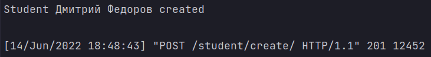
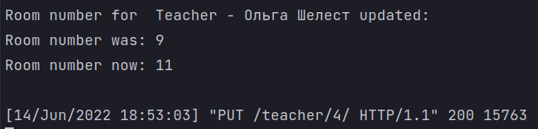
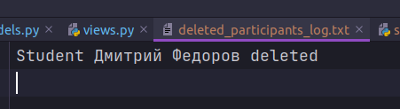

# Лабораторная работа №2. Возможности DRF.
## 2_4 Задание
Реализовать 3 сигнала, которые:

- Вызывает логику, во время создания экземаляра объекта.
- Сохраняет значения выбранных полей в таблице в специальные поля для хранения предыдущих значений при обновлении объекта.
- При удалении объекта записывает информацию об удалении в лог реализованный любым образом.
  
Код и пример вывода описать в mkdocs на странице с названием "2.2.2 Кастомная пагинация"

---
## Выполнение задания
### Сигнал при создании экземпляра класса

```python
@receiver(post_save, sender=Student)
def create_participant(sender, instance, created, **kwargs):
    if created:
        print(f'Student {instance.first_name} {instance.last_name} created\n')
```

### Сигнал при изменении экземпляра класса

```python
@receiver(pre_save, sender=Teacher)
def update_teacher_room(sender, instance, **kwargs):
    prev_instance = Teacher.objects.get(id=instance.id)
    instance.old_room = prev_instance.room
    print(f'Room number for  Teacher - {instance.first_name} {instance.last_name} updated: \n'
          f'Room number was: {instance.old_room}\n'
          f'Room number now: {instance.room}\n')
```

### Сигнал при удалении экземпляра класса

```python
@receiver(pre_delete, sender=Student)
def delete_participant(sender, instance, **kwargs):
    with open('deleted_participants_log.txt', 'a') as f:
        f.write(f'Student {instance.first_name} {instance.last_name} deleted\n')
```
