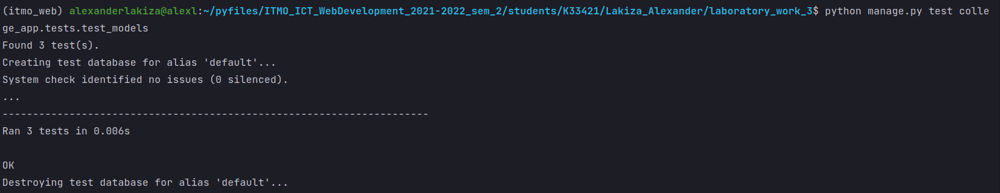

# Лабораторная работа №3. Тесты Django REST Framework.
## 3_1 Задание
- Написать тесты на модель в Вашем API (3 таблицы)

---
## Выполнение задания
### Тест создания объекта `Subject`
```python
class SubjectNameModelTest(TestCase):

    @classmethod
    def setUpTestData(cls):
        Subject.objects.create(
            name='Математика',
        )

    def test_medal_field_value(self):
        subject_instance = Subject.objects.get(id=1)
        self.assertEquals(subject_instance.name, 'Математика')
```
### Тест проверки свойства поля имени `Group`
```python
class GroupNameLengthModelTest(TestCase):

    @classmethod
    def setUpTestData(cls):
        Group.objects.create(
            name='K33421'
        )

    def test_passport_max_length(self):
        group_instance = Group.objects.get(id=1)
        max_length = group_instance._meta.get_field('name').max_length
        self.assertEquals(max_length, 40)
```
### Тест проверки типа поля `Pair`
```python
class PairFieldTypeModelTest(TestCase):

    @classmethod
    def setUpTestData(cls):
        Teacher.objects.create(
            first_name='Светлана',
            last_name='Козлова'
        )

        Group.objects.create(
            name='K33421'
        )

        Subject.objects.create(
            name='Математика',
        )

        Pair.objects.create(
            name_day='Fri',
            room=31,
            group=Group.objects.get(id=1),
            pair_number=4,
            teacher=Teacher.objects.get(id=1),
            subject=Subject.objects.get(id=1)
        )

    def test_vaccinated_field_type(self):
        pair_instance = Pair.objects.get(id=1)
        room_filed = pair_instance._meta.get_field('room')
        self.assertTrue(isinstance(room_filed, IntegerField))
```
Все фильтры сработали:


