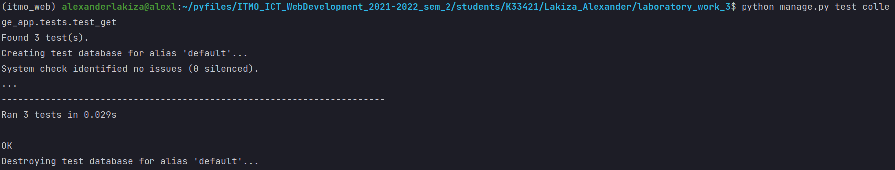

# Лабораторная работа №3. Тесты Django REST Framework.
## 3_2 Задание, GET Requests Tests
- Написать тесты на ендпоинты в Вашем API (3 GET запроса)

---
## Выполнение задания
### Тест `Subject`
```python
class SubjectTest(TestCase):

    @classmethod
    def setUpTestData(cls):
        Subject.objects.create(
            id=1,
            name='Математика',
        )

    def test_get_participant(self):
        url = reverse('college_app:subject', args=['1'])

        data = {
            'id': 1,
            'name': 'Математика'
        }

        response = self.client.get(url, format='json')
        self.assertEqual(response.status_code, status.HTTP_200_OK)
        self.assertEqual(response.json(), data)
```
### Тест `Teacher` + `Subject`
```python
class TeacherSubjectTest(TestCase):

    @classmethod
    def setUpTestData(cls):
        Subject.objects.create(
            id=1,
            name='Математика',
        )

        Teacher.objects.create(
            id=1,
            first_name='Светлана',
            last_name='Козлова'
        )

        SubjectToTeacher.objects.create(
            id=1,
            subject=Subject.objects.get(id=1),
            teacher=Teacher.objects.get(id=1)
        )

    def test_get_participant(self):
        url = reverse('college_app:teacher', args=['1'])

        data = {
            'id': 1,
            'first_name': 'Светлана',
            'last_name': 'Козлова',
            'subjects': [{'id': 1, 'name': 'Математика'}],
            'old_room': None,
            'room': ''
        }

        response = self.client.get(url, format='json')

        self.assertEqual(response.status_code, status.HTTP_200_OK)
        self.assertEqual(response.json(), data)
```
### Тест `Pair`
```python
class PairTest(TestCase):

    @classmethod
    def setUpTestData(cls):
        Teacher.objects.create(
            first_name='Светлана',
            last_name='Козлова'
        )

        Group.objects.create(
            name='K33421'
        )

        Subject.objects.create(
            name='Математика',
        )

        Pair.objects.create(
            name_day='Fri',
            room=31,
            group=Group.objects.get(id=1),
            pair_number=4,
            teacher=Teacher.objects.get(id=1),
            subject=Subject.objects.get(id=1)
        )

    def test_get_participant(self):
        url = reverse('college_app:pair', args=['1'])

        data = {
            "id": 1,
            "pair_number": 4,
            "name_day": "Fri",
            "room": 31,
            "group": 1,
            "teacher": 1,
            "subject": 1
        }

        response = self.client.get(url, format='json')

        self.assertEqual(response.status_code, status.HTTP_200_OK)
        self.assertEqual(response.json(), data)
```
Все тесты сработали:


