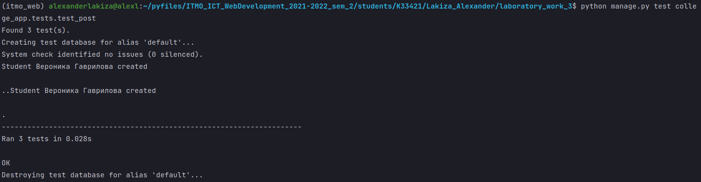

# Лабораторная работа №3. Тесты Django REST Framework.
## 3_3 Задание, POST Requests Tests
- Написать тесты на ендпоинты в Вашем API (3 POST запроса)

---
## Выполнение задания
### Тест создания объекта `Student`
```python
class CreateStudentTest(TestCase):

    def test_create_medal(self):
        url = reverse('college_app:student_create')

        data = {
            'id': 1,
            'first_name': 'Вероника',
            'last_name': 'Гаврилова',
            'group': []
        }

        response = self.client.post(url, data, format='json')
        self.assertEqual(response.status_code, status.HTTP_201_CREATED)
        self.assertEqual(response.json(), data)
```
### Тест создания `Mark`
```python
class CreateMarkTest(TestCase):

    @classmethod
    def setUpTestData(cls):
        Student.objects.create(
            id=1,
            first_name='Вероника',
            last_name='Гаврилова'
        )

        Subject.objects.create(
            id=1,
            name='Математика'
        )

    def test_create_participant(self):
        url = reverse('college_app:mark_create')

        data = {
            'id': 1,
            'subject': 1,
            'student': 1,
            'mark': 5
        }
        response = self.client.post(url, data, format='json')
        self.assertEqual(response.status_code, status.HTTP_201_CREATED)
        self.assertEqual(response.json(), data)
```
### Тест создания `Pair`
```python
class CreatePairTest(TestCase):

    @classmethod
    def setUpTestData(cls):
        Teacher.objects.create(
            first_name='Светлана',
            last_name='Козлова'
        )

        Group.objects.create(
            name='K33421'
        )

        Subject.objects.create(
            name='Математика',
        )

    def test_create_participant(self):
        url = reverse('college_app:pair_create')

        data = {
            'id': 1,
            'name_day': 'Fri',
            'room': 31,
            'group': 1,
            'pair_number': 4,
            'teacher': 1,
            'subject': 1
        }
        response = self.client.post(url, data, format='json')
        self.assertEqual(response.status_code, status.HTTP_201_CREATED)
        self.assertEqual(response.json(), data)
```
Все фильтры сработали:


