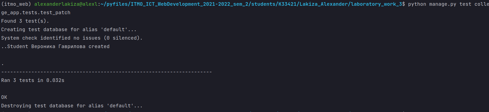

# Лабораторная работа №3. Тесты Django REST Framework.
## 3_4 Задание, PATCH Requests Tests
- Написать тесты на ендпоинты в Вашем API (3 PATCH запроса)

---
## Выполнение задания
### Тест изменения названия группы у объекта `Group`
```python
class UpdateGroupTest(TestCase):

    @classmethod
    def setUpTestData(cls):
        Group.objects.create(
            id=1,
            name='K3242'
        )

    def test_update_club(self):
        url = reverse('college_app:group', args=['1'])

        data = {
            'id': 1,
            'name': 'K33421'
        }

        response = self.client.patch(url, json.dumps({'name': 'K33421'}),
                                     content_type='application/json')
        self.assertEqual(response.status_code, status.HTTP_200_OK)
        self.assertEqual(response.data, data)
```
### Тест изменения номера пары и дня недели у объекта `Pair`
```python
class UpdatePairTest(TestCase):

    @classmethod
    def setUpTestData(cls):
        Teacher.objects.create(
            id=1,
            first_name='Светлана',
            last_name='Козлова'
        )

        Group.objects.create(
            id=1,
            name='K33421'
        )

        Subject.objects.create(
            id=1,
            name='Математика',
        )

        Pair.objects.create(
            id=1,
            name_day='Fri',
            room=31,
            group=Group.objects.get(id=1),
            pair_number=4,
            teacher=Teacher.objects.get(id=1),
            subject=Subject.objects.get(id=1)
        )

    def test_update_club(self):
        url = reverse('college_app:pair', args=['1'])

        data = {
            'id': 1,
            'name_day': 'Mon',  # поменяем день недели
            'room': 31,
            'group': 1,
            'pair_number': 1,  # поменяем номер пары
            'teacher': 1,
            'subject': 1
        }

        response = self.client.patch(url, json.dumps({'name_day': 'Mon',
                                                      'pair_number': 1}),
                                     content_type='application/json')
        self.assertEqual(response.status_code, status.HTTP_200_OK)
        self.assertEqual(response.data, data)
```
### Тест изменения групп у студента
```python
class UpdateStudentGroupTest(TestCase):

    @classmethod
    def setUpTestData(cls):
        Group.objects.create(
            id=1,
            name='K3242',
        )

        Group.objects.create(
            id=2,
            name='K33421',
        )

        Student.objects.create(
            id=1,
            first_name='Вероника',
            last_name='Гаврилова'
        )

        StudentToGroup.objects.create(
            id=1,
            student=Student.objects.get(id=1),
            group=Group.objects.get(id=1)
        )

    def test_update_club(self):
        url = reverse('college_app:student_group', args=['1'])
        get_url = reverse('college_app:student', args=['1'])

        data = {
            "id": 1,
            "group": [
                {
                    "id": 2,
                    "name": "K33421"
                }
            ],
            "first_name": "Вероника",
            "last_name": "Гаврилова"
        }

        response = self.client.patch(url, json.dumps({"group": 2}),
                                     content_type='application/json')
        get_response = self.client.get(get_url, format='json')
        self.assertEqual(response.status_code, status.HTTP_200_OK)
        self.assertEqual(get_response.json(), data)
```
Все фильтры сработали:


