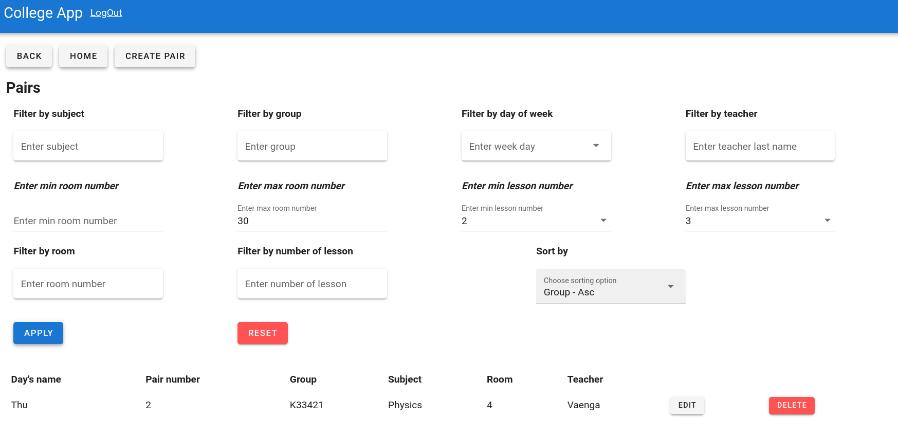

# Лабораторная работа №4. Адаптация интерфейсов vue.js.
Необходимо реализовать интерфейс списков объектов, в котором подключить фильтры из второй лабораторной. В интерфейсе должен быть обеспечен следующий функционал:

- сортировка объектов.
- пагинация.
- поиск по объектам.
- фильтрация с чекбоксами.
- фильтры на диапазон.  

Можно сказать, необходимо реализовать страничку с фильтрами, как в интернет магазине и подключить к бэкенду.

Для реализации поставленной задачи на фронтенде можно использовать функционал для работы с таблицами в библиотеке vuetifyjs

---
## Выполнение задания
### Пример интерфейса для просмотра всех пар в колледже

В данном интерфейсе реализованы:

- фильтрация пар по предмету
- фильтрация пар по учителю
- фильтрация пар по дню недели
- фильтрация пар по номеру урока
- фильтрация пар по аудитории
- фильтры на диапазон аудитории
- фильтры на диапазон номера урока
- сортировка записей по разным характеристикам
- пагинация
- триггеры для перехода между страницами
- триггеры для добавления, удаления записей

### Пример интерфейса для просмотра всех оценок

В данном интерфейсе реализованы:

- фильтрация оценок по имени студента
- фильтрация оценок по фамилии студента
- фильтрация по названию предмета
- фильтрация по группе
- фильтрация по значению оценки
- фильтры на диапазон оценки
- сортировка записей по разным характеристикам 
- пагинация
- триггеры для перехода между страницами
- триггеры для добавления, удаления записей
